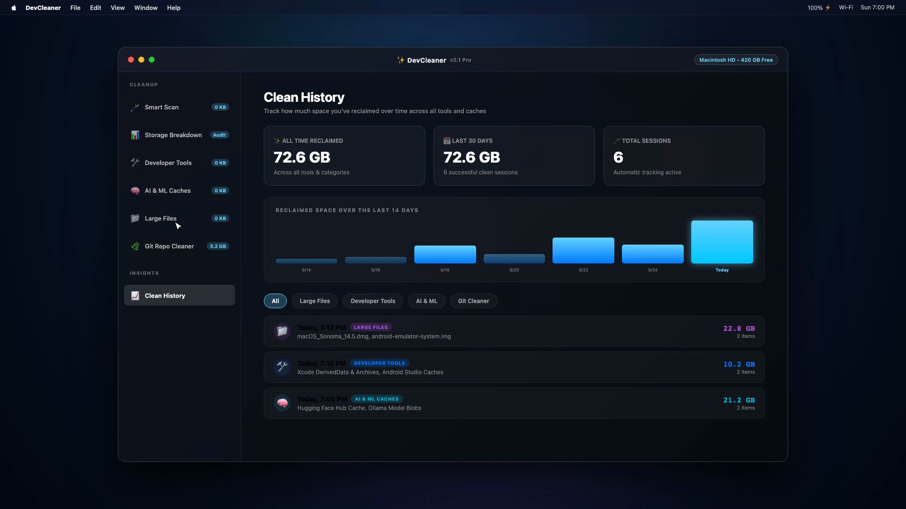

<div align="center">

# ✨ DevCleaner for macOS
### The Ultimate High-Performance Developer Disk Cleaner & Optimizer

[](https://github.com/khawarahemad/DevCleaner/releases/latest)
[](https://apple.com)
[](https://developer.apple.com/xcode/swiftui/)
[](https://github.com/sponsors/khawarahemad)
[](LICENSE)

<p align="center">
  <b>Reclaim 20GB – 100GB+ of hidden developer junk, Xcode derived data, local AI model blobs, package caches, and build artifacts in seconds.</b>
</p>

<br/>

### 📦 Download Latest Release (v2.2.0)

<a href="https://github.com/khawarahemad/DevCleaner/releases/download/v2.2.0/DevCleaner-v2.2.0.dmg">
  
</a>
&nbsp;&nbsp;
<a href="https://github.com/khawarahemad/DevCleaner/releases/download/v2.2.0/DevCleaner-v2.2.0-macOS.zip">
  
</a>

<br/><br/>

---

</div>

## 🎬 1080p Feature Tour (with Audio)

Watch the complete demonstration showcasing the glassmorphic dark-mode interface, real-time scanning gauges, dedicated utilities, and the upgraded Clean History system:

<div align="center">

https://github.com/khawarahemad/DevCleaner/raw/main/assets/devcleaner_cinematic_demo.mp4

<a href="https://github.com/khawarahemad/DevCleaner/raw/main/assets/devcleaner_cinematic_demo.mp4">
  
</a>

<p align="center">
  ▶️ <b><a href="https://github.com/khawarahemad/DevCleaner/raw/main/assets/devcleaner_cinematic_demo.mp4">Click here to watch or download the full 1080p 60FPS video with sound</a></b>
</p>

</div>

---

## 💎 Licensing & Pricing Plans

DevCleaner is built for both everyday users and professional software engineers:

- **Free Tier (Always Free)**: macOS User & System Caches, Crash Reports & System Logs, Trash Bin, Package Managers (NPM, Pip), Storage Breakdown (disk gauge & category explorer; directory paths hidden), and Clean History.
- **Pro Tier (Paid Developer Tools)**: Xcode (DerivedData, Archives, iOS Simulators), Android Studio, Gradle, Docker Disks, AI/ML Model Caches (Ollama, HuggingFace, Cursor), Duplicate Files Finder, Large Files Finder, Git Repository Purge, App Uninstaller, Startup Items, Smart Scan, and Full Directory Path Inspection & Finder reveal in Storage Breakdown.

### 💰 Pricing
| Plan | Price | Validity | Best For |
| :--- | :--- | :--- | :--- |
| **Pro Monthly** | **₹99** | 30 Days | Trying out deep developer cleaning |
| **Pro Quarterly** | **₹199** | 90 Days | **Popular** (Save 33%) |
| **Pro Yearly** | **₹599** | 365 Days | **Best Value** (Save 50%) |

> **Hardware-Locked Security**: Each subscription is permanently tied to a single Mac via native `IOPlatformUUID` hardware verification. Even if an active session is unlinked, the license remains reserved exclusively for the original Mac and cannot be transferred or shared with other devices.

---

## 💻 Installation & macOS Gatekeeper Guide

### Standard Installation
1. Download **[DevCleaner-v2.2.0.dmg](https://github.com/khawarahemad/DevCleaner/releases/download/v2.2.0/DevCleaner-v2.2.0.dmg)**.
2. Double-click the `.dmg` and drag **DevCleaner.app** into your **Applications** folder.

---

### 🛡️ How to Open If macOS Says "Developer Cannot Be Verified"

Because DevCleaner is a community-driven, free open-source project and is distributed outside the official Mac App Store without an annual paid Apple Developer certificate, macOS Gatekeeper may show a standard prompt on first launch:

> *"DevCleaner cannot be opened because Apple cannot check it for malicious software"*  
> or  
> *"DevCleaner is from an unidentified developer."*

This is standard macOS security behavior for independent open-source tools. You can approve and open DevCleaner in seconds using any of the 3 simple methods below:

#### ⚡ Method 1: Right-Click / Control-Click (Recommended — Takes 3 Seconds)
1. Open Finder and go to your **Applications** folder.
2. **Right-click** (or hold <kbd>Control</kbd> and click) on **DevCleaner.app**.
3. Choose **Open** from the context menu.
4. On the dialog prompt that appears, click **Open** (or **Open Anyway**).
5. *You only have to do this once. macOS will remember your decision and open normally from now on!*

#### ⚙️ Method 2: System Settings → Privacy & Security
1. If you double-clicked the app and saw the warning dialog, click **Done** or **OK**.
2. Open **System Settings** on your Mac ( Apple menu → **System Settings**).
3. In the sidebar, select **Privacy & Security**.
4. Scroll down to the **Security** section.
5. You will see a message:  
   *`"DevCleaner" was blocked from use because it is not from an identified developer.`*
6. Click the **Open Anyway** button next to it.
7. Enter your Mac administrator password or use Touch ID, then click **Open**.

#### 🖥️ Method 3: One-Line Terminal Command (For Developers & Power Users)
Open your Terminal and run:
```bash
xattr -cr /Applications/DevCleaner.app
```
*This command clears the `com.apple.quarantine` extended attribute, allowing DevCleaner to launch instantly without any security prompts.*

---

### 🔐 Full Disk Access Permission (Required for Deep Cleaning)
To safely calculate and clean system-level developer caches (like Xcode DerivedData, Docker VM layers, and Android build caches located in `~/Library/Caches`), macOS requires **Full Disk Access**:

1. Open **System Settings → Privacy & Security → Full Disk Access**.
2. Click the **+** button or toggle the switch next to **DevCleaner**.
3. Relaunch DevCleaner.

---

## 🎨 What's Inside

| Feature | Description |
| :--- | :--- |
| **🪄 Smart System Scan** | One-click audit across 30+ developer tools, package caches, and system junk targets. |
| **🛠️ Developer Tools** | Xcode DerivedData, Archives, iOS DeviceSupport, Android Studio, Gradle, Docker, JetBrains, CocoaPods. |
| **🧠 AI & ML Caches** | Reclaim space from Ollama LLMs (`~/.ollama/models`), Hugging Face hub, PyTorch, Cursor, and VS Code AI. |
| **📦 Package Managers** | Clean global package caches for NPM, Yarn, Rust Cargo, Python Pip, Bun, Go modcache, and Flutter. |
| **📁 Large Files Cleaner** | Ranks your drive's top 100MB+ oversized files with Reveal in Finder and quick removal. |
| **👯 Duplicate Files Finder** | Identifies files with matching MD5 content hashes across user directories to eliminate duplicate files. |
| **🌿 Git Repo Cleaner** | Discovers Git repositories across your machine and clears heavy `.build/` and `node_modules/` folders without touching source code. |
| **🗑️ App Uninstaller** | Safely uninstalls applications along with every orphaned file left behind in `~/Library/Application Support` and `~/Library/Caches`. |
| **⚡ Startup Items Manager** | Lists active user `LaunchAgents` and system `LaunchDaemons` to keep boot times snappy. |
| **📈 Clean History** | Unified tracking across all tools with a 14-day activity chart, color-coded badges, and expandable file lists. |

---

## 🔍 Popular Search Keywords & Tags

DevCleaner is built for macOS software engineers, data scientists, and developers looking for:
`macos disk cleaner`, `xcode deriveddata cleaner`, `clean xcode cache`, `free cleanmymac alternative`, `docker prune macos`, `ollama model cleaner`, `huggingface cache cleaner`, `android studio gradle cache clean`, `cocoapods cache clean`, `npm cache clean force`, `bun package cache`, `rust cargo clean registry`, `mac duplicate file finder`, `git clean node_modules`, `swift package manager cache clean`, `mac storage breakdown`, `macos app uninstaller free`, `developer disk space optimizer`.

---

## 🛠️ Source Code & Contributing

The complete source code of DevCleaner is published and maintained at:  
👉 **[github.com/khawarahemad/DevCleanerSrc](https://github.com/khawarahemad/DevCleanerSrc)**

Issues, feature requests, and community pull requests are welcome!

---

## 📄 License

DevCleaner is open source software released under the [MIT License](LICENSE).
